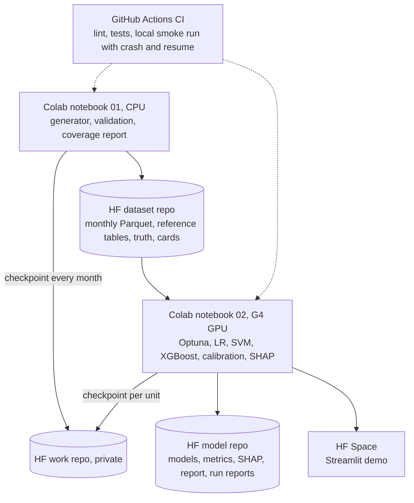

# Trade Settlement Fail Predictor

Predicting which trades will fail to settle, and explaining why, with three models: logistic
regression as the baseline, a support vector machine trained with SMOTE, and XGBoost with SHAP.

> **All data in this project is synthetic.** It is generated by a seeded generator in this repo.
> There are no real trades, counterparties, or securities, and the results show the pipeline and
> the modeling approach, not performance on real data.

| | |
|---|---|
| Live demo (Hugging Face Space) | https://huggingface.co/spaces/rohanjain2312/trade-settlement-fail-predictor-demo |
| Dataset | https://huggingface.co/datasets/rohanjain2312/settlement-trades-synthetic |
| Models, metrics, run reports | https://huggingface.co/rohanjain2312/trade-settlement-fail-predictor |
| Static results (fallback if the Space is down) | [RESULTS.md](https://huggingface.co/rohanjain2312/trade-settlement-fail-predictor/blob/main/report/RESULTS.md) |
| The 20 features | [docs/FEATURES.md](docs/FEATURES.md) |
| Article: what I'd do differently, in plain English | [docs/blog/predicting-trade-settlement-fails.md](docs/blog/predicting-trade-settlement-fails.md) |

[](https://colab.research.google.com/github/Rohanjain2312/trade-settlement-fail-predictor/blob/main/notebooks/01_generate_data.ipynb)
Notebook 01: generate, validate, and publish the data (CPU)

[](https://colab.research.google.com/github/Rohanjain2312/trade-settlement-fail-predictor/blob/main/notebooks/02_train_explain.ipynb)
Notebook 02: tune, train, calibrate, explain, publish, deploy the app (GPU)


## The problem

A trade fails when the securities or the cash do not move on the intended settlement date. Fails tie
up capital, trigger penalties, and land in an operations queue. Ops can work only so many trades a
day, so the useful output is a calibrated risk score for every open trade: work the riskiest first
and fix them before settlement. The demo's ops queue simulator shows that mechanism as a what-if
under stated assumptions.

## How it works



- **Data.** About 3.1 million trades over 24 months of business days, about 3% failed, for 300
  fictional counterparties and 5,000 fictional securities. The fail probability is a planted logistic
  function of the 20 features plus three interactions, hidden counterparty and security risk, and
  noise, so the true drivers are known.
- **No leakage.** Rolling features use only outcomes known on the trade date. Splits follow trade
  date with a 5-business-day gap. SMOTENC sits inside an `imblearn` pipeline, so it only ever sees
  training rows or training folds. Tests prove each of these.
- **Coverage.** A scenario catalog (SSI breaks, shortfalls, late confirmations, chain cascades,
  cross-border holidays, corporate actions, amendments, regimes, hard negatives, unexplained fails)
  is injected on purpose and measured in every split by a coverage report.
- **Models.** Each model family is trained three ways (no resampling, class weights, SMOTENC),
  tuned with Optuna and time-series cross-validation, then calibrated on the validation period.
  The RBF SVM trains on a stratified subsample with cuML on the GPU.
- **Explanations.** Logistic regression coefficients, an SVM boundary and SMOTE illustration, a
  boosted tree and its learning curve, SHAP values and interactions from XGBoost on the GPU, and a
  check of SHAP against the planted truth.
- **Evaluation.** PR-AUC, recall at fixed precision, recall in the top 1% and 2% of trades,
  calibration and Brier score, all overall and per scenario, plus a held-out scenario experiment.

## Reproduce

Everything runs in the cloud: Colab for data and training, GitHub Actions for tests, Hugging Face for
storage and the demo. Open notebook 01, then notebook 02, and press Run all. Each notebook has two
cells and needs a Hugging Face write token in Colab Secrets as `HF_TOKEN`.

- `config/run.yaml` sets the mode: `smoke` (small sample, private `-smoke` repos), `full`, or `auto`
  (smoke first, then full).
- Every stage checkpoints to a private work repo. After a disconnect, press Run all again and the run
  resumes; a restarted generator produces data identical to an uninterrupted run.
- Every number comes from `config/params.yaml` and the seed. Each run writes a report to the model
  repo's `runs/` folder.

## Repo layout

```
config/                 params, scenarios and coverage rules, smoke overrides, run mode
src/features/           definitions.py: the single source of truth for the 20 features
src/data/               reference data, generator, probability function, scenarios, validation, coverage
src/models/             preprocessing, LR, SVM, XGBoost, tuning, calibration, evaluation
src/explain/            SVM and SHAP views, app assets, static report
src/sim/                ops queue simulator
src/pipeline/           stores (Hub and local), checkpointing, run reports, the two notebook pipelines
src/hub/                repo creation, publishing, Space deploy
notebooks/              the two Colab notebooks
app/                    Streamlit app (deployed as a Docker Space)
tests/                  leakage, distinctness, rates, rolling features, SMOTE in train only, coverage,
                        golden set and monotonicity, checkpoint and resume, local smoke pipeline
```

## Scope and limits

Coverage means coverage of the scenarios defined in `config/scenarios.yaml`. Out of scope: partial
settlements, buy-in regimes, penalty mechanics under specific regulations, and market-wide outages.
Real production data always contains cases nobody planned for. The models are a demonstration and
must not be used for real settlement decisions.

## License

MIT
