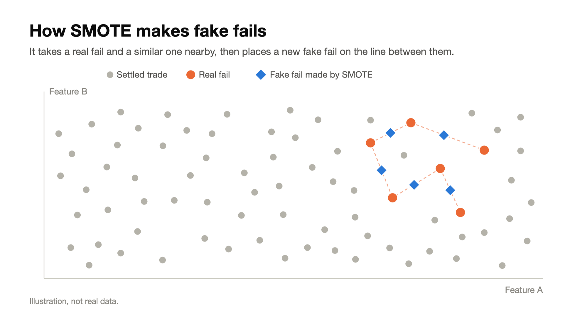
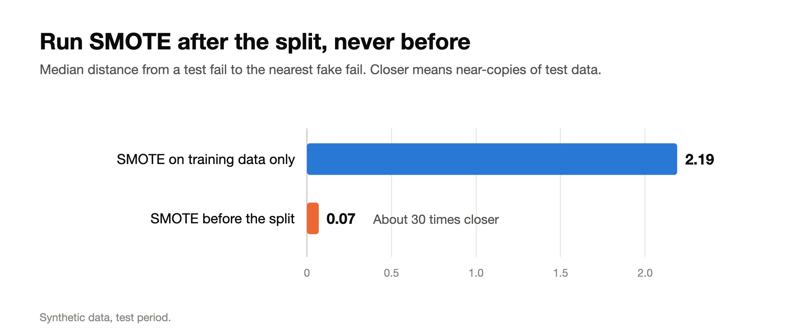
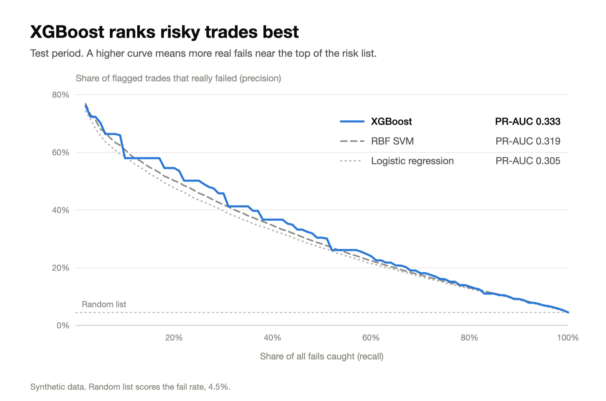
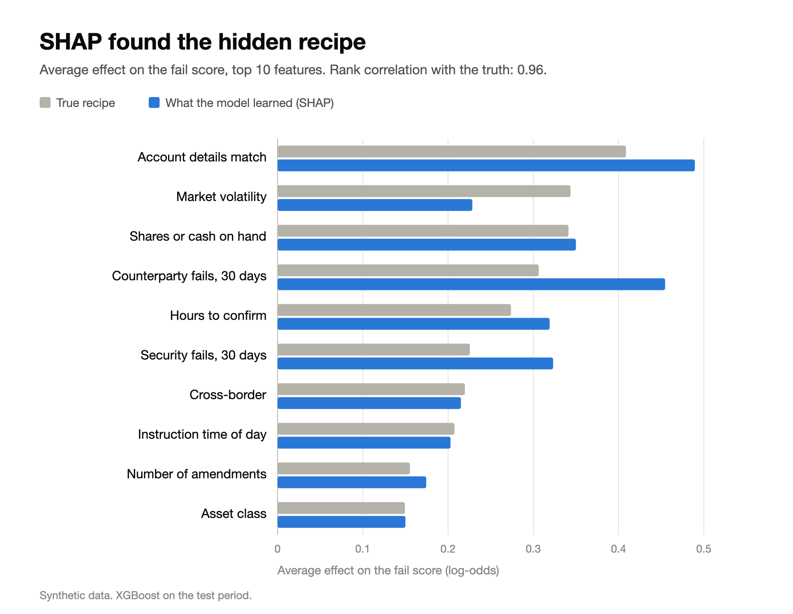
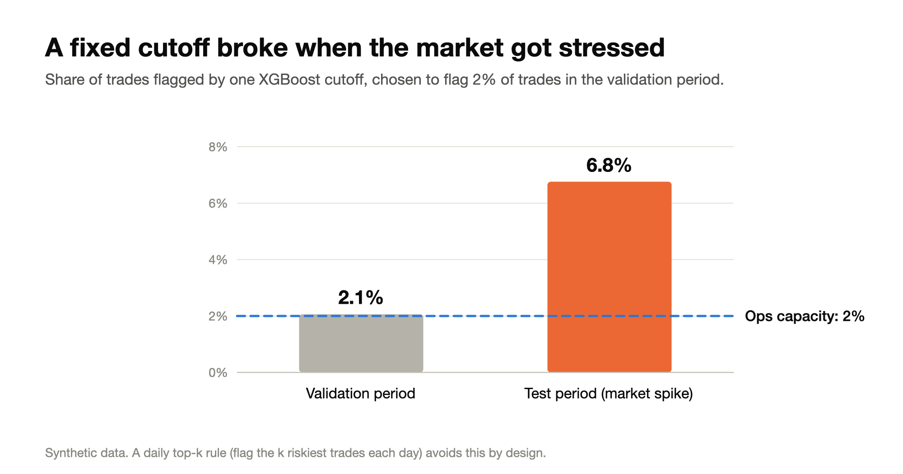

<!--
Medium draft, version 3 (2026-10-09). These notes do not show on GitHub and are not part of the article.
- Images: upload the PNGs in docs/blog/images to Medium in the places marked below. Keep the captions.
- Cover image: images/cover.png.
- Medium has no table support: replace each markdown table with its image (table1_model_results.png, table2_new_fails.png).
- Medium has no nested lists, so every list here is one level deep.
- "What I'd do differently" lines are quotes: use Medium's quote style for them.
- Tags (5): Machine Learning, Data Science, Imbalanced Data, XGBoost, Fintech.
- Publish as a free story (not member-only), so recruiters can read it.
- Every number comes from the final full run in report/RESULTS.md on the Hugging Face model repo.
-->

# Predicting Trade Settlement Fails: What I’d Do Differently, From SVM + SMOTE to XGBoost + SHAP

*I rebuilt a model I first made at my workplace, using 3.1 million synthetic trades where I knew the right answers. Here is what changed, in plain English.*

---

- At my workplace, I built a model to spot trades likely to fail.
- It was an SVM (support vector machine) trained with SMOTE, a popular trick when the thing you're looking for is rare.
- Tools have changed since then, so I rebuilt it to see what I'd do differently today.
- **Every trade here is synthetic**, generated by code.
- That's an advantage: I wrote the rules that decide which trades fail, so I could check whether each model found them. You can't do that with real data.

**What I'd change, in short:**

1. **Class weights and my own cutoff** instead of SMOTE's fake trades.
2. **XGBoost instead of an SVM**, with logistic regression as the baseline.
3. **Calibrated probabilities**, fitted on data the model never trained on.
4. **SHAP explanations** for every alert, so the operations team knows what to fix.
5. **Daily alert counts set by team capacity**, not a fixed cutoff.
6. **A known answer key and leakage tests** before trusting any result.

## What is a settlement fail?

- **Think of buying a house.** Money and keys swap hands on closing day. If the money is late or the bank details are wrong, closing slips.
- **Trades work the same way.** Shares and cash swap hands a day or two after the trade, on the **settlement date**. If either side doesn't arrive, the trade **fails to settle**.
- **Fails are costly.** Money gets stuck, penalties pile up, and an operations ("ops") team has to chase each one.
- **Ops can only check a few trades a day.** So the real question isn't "will this trade fail?" It's **"which trades should we check first?"**
- **The answer is a ranked list**, riskiest first.

## Why accuracy is the wrong score

- In the test period, 4.5% of trades failed.
- A "model" that says "every trade will settle" is 95.5% accurate and catches zero fails.

So I used three scores that focus on the fails:

- **PR-AUC.** Going down the ranked list: how many flagged trades are real fails (precision), and how many of all fails have you caught (recall)? One number from 0 to 1. A random list scores 0.045 here.
- **Recall in the top 2%.** If ops check 2% of trades a day, what share of all fails is in that 2%? A random pick catches about 2%.
- **Brier score.** When the model says "30% chance of failing", does that happen about 30% of the time? Lower is better.

## Building fake data that is still useful

- **Size:** about 3.1 million trades over 24 months.
- **Players:** 300 made-up counterparties (the firms on the other side of each trade) and 5,000 made-up securities.
- **Fail rate:** about 3%.

**20 features per trade**, for example:

- Do the account details (where shares and cash should go) match what's on file?
- How long did the other side take to confirm the trade?
- Do we have the shares or cash we owe?
- How often has this counterparty failed in the last 30 days?
- Is the trade cross-border?

**A hidden "recipe"** turns these into a chance of failing. Each feature pushes the risk up or down by an amount I chose. Three combinations are extra risky together:

- Wrong account details **+** a cross-border trade
- Short on shares **+** a security that keeps failing
- Slow confirmation **+** an instruction sent overnight

**Real-life mess, added on purpose:**

- Hidden risk that isn't in the data
- Random noise
- Near misses (a broken instruction fixed just in time)
- About 1.5% of fails with no visible cause

> **What I'd do differently:** test a method on data with a known answer key before trusting it on real data.

## Three ways to cheat by accident

- **Data leakage** is when information from the future, or from the test set, sneaks into training.
- It's like a student who saw the exam answers: great practice scores, then a shock on the real exam.

**1. Features that peek into the future**

- "Counterparty fail rate, last 30 days" sounds harmless.
- But yesterday's trade may not have settled yet, so its outcome is still unknown.
- Fix: count only trades that settled *before* today.

**2. Shuffled splits**

- A random split lets the model train on next month and get tested on last month.
- Fix: split by date. 16 months to train, 4 to validate, 4 to test.
- Leave a 5-business-day gap, so no trade is still settling across a boundary.

**3. SMOTE before the split**

- SMOTE makes fake failed trades by placing new points on the line between a real fail and a similar one.
- SMOTENC is the version that also handles categories.


*SMOTE fills the gaps between real fails with fake ones. Illustration.*

- Run SMOTE on the full dataset before splitting, and some fake trades are built from test trades.
- The model then trains on near copies of the test set.
- I measured it: test fails had a fake fail **about 30 times closer** (median distance 0.07 versus 2.19).


*The smaller the distance, the more the model has effectively seen the test set. Synthetic data.*

- Fix: make SMOTE a step inside the model pipeline, so it only runs during training.

```python
from imblearn.pipeline import Pipeline
from imblearn.over_sampling import SMOTENC
from sklearn.svm import LinearSVC

pipe = Pipeline([
    ("encode", encoder),   # turn categories into numbers
    ("smote", SMOTENC(categorical_features=cat_cols, random_state=42)),
    ("scale", scaler),     # one-hot encode and scale
    ("model", LinearSVC()),
])

pipe.fit(X_train, y_train)  # SMOTE runs here, on training rows only
pipe.predict(X_test)        # SMOTE never touches test rows
```

- Bonus: the `imblearn` Pipeline keeps cross-validation safe too. SMOTE only sees the training part of each fold.

> **What I'd do differently:** turn each rule into an automated test, so the build fails if anyone breaks one.

## From SVM to XGBoost

**SVM**

- Picture fails and non-fails as dots on a page.
- An SVM draws the widest possible street between the two groups.
- Only the dots at the edge of the street (the "support vectors") decide where it goes. The RBF version draws curvy streets.
- The catch: it compares trades in pairs, so 10 times the data is roughly 100 times the work.
- I had to train it on a 100,000-trade sample on a GPU, and scoring was still slow.

**XGBoost**

- Builds hundreds of small decision trees, one after another.
- Each tree is a short list of yes/no questions: "Do the instructions match? Is it cross-border?"
- Each new tree fixes what the earlier ones still get wrong, like a team of reviewers.
- Handles categories and missing values on its own, and scales to millions of rows.

**Logistic regression (the baseline)**

- Simple and easy to read: a mismatched instruction multiplies the odds of failing by about 8.7.
- Did well (PR-AUC 0.305), because most of my recipe is a simple sum of effects.
- But on its own, it can't see combinations like wrong account details + cross-border.


*XGBoost (blue) stays on top across most of the list. Synthetic data, test period.*

| Model | Best training setup | PR-AUC | Fails caught in riskiest 2% of trades | Brier score |
|---|---|---|---|---|
| Random list | | 0.045 | 2% | |
| Logistic regression | No resampling | 0.305 | 21% | 0.037 |
| Linear SVM | No resampling | 0.296 | 20% | 0.037 |
| RBF SVM | Class weights | 0.319 | 22% | 0.036 |
| **XGBoost** | No resampling | **0.333** | **23%** | **0.035** |

*Test period, synthetic data. Higher is better for PR-AUC and fails caught; lower is better for the Brier score (after calibration).*

**Results**

- **XGBoost: PR-AUC 0.333**, about 7 times better than a random list.
- It caught **23%** of all fails in the riskiest 2% of trades.
- Every model was tuned with Optuna, which searches for good settings automatically without peeking at the future.

> **What I'd do differently:** start with XGBoost for table-shaped data, with logistic regression as the baseline to beat.

## Turning scores into probabilities you can trust

- An SVM gives a distance from the street, not a probability. "2.1 units from the line" means nothing to an ops manager.
- **Calibration** fixes this. An S-shaped curve (Platt scaling) maps scores to probabilities: score 0 → about 3%, 1 → about 25%, 2 → about 79%.
- Class weights distort probabilities too: telling the model "fails matter more" makes it overestimate risk.
- XGBoost with class weights had a Brier score of 0.213 before calibration and **0.035 after**.
- **Rule 1:** fit the calibration on separate validation data, never on training or test data. Otherwise you're grading your own homework.
- **Rule 2:** recheck it over time. For the riskiest test trades, the SVM's curve predicted about 37%, but only about 27% failed.

> **What I'd do differently:** always calibrate, and keep checking it.

## Explaining every alert with SHAP

- When ops see a flagged trade, the first question is "why?"
- **SHAP** splits each trade's score into one piece per feature. The pieces add up to the final score.
- Think of it as a receipt: base risk, plus some for wrong account details, plus some for cross-border, minus some because the shares are in place.

**Checking SHAP against the truth** (possible only because I wrote the recipe):

- It ranked the features in almost the same order: **rank correlation 0.96** (1.0 is a perfect match).
- Out of 190 possible feature pairs, it ranked the **three planted combinations #1, #2 and #3**.


*Gray: the true recipe. Blue: what the model learned. Synthetic data.*

**The gaps make sense:**

- **Counterparty fail rate** ranked higher: it also stands in for hidden counterparty risk.
- **Market volatility** ranked lower: the test period's spike went beyond anything the trees saw in training.

> **What I'd do differently:** ship every alert with its reasons, turned into actions like "fix the account details". An SVM gives a score; XGBoost with SHAP also gives the why.

## Set the number of daily alerts, not a fixed cutoff

- A cutoff that flagged 2% of trades in the validation period flagged **6.8%** in the test period, which had a market spike.
- That's more than 3 times what ops planned for.


*The same cutoff, two different periods. Synthetic data.*

- Better rule: each day, flag the **top k trades**, where k is the number the team can actually check.
- What-if: ops check 2% of trades a day and fix 60% of the fails they reach. Ranking with XGBoost cut pending fails by about **12%** versus no ranking.
- That's a simulation on synthetic data, not a measured result.

> **What I'd do differently:** let team capacity set the number of daily alerts, and watch for drift.

## Limits

**New kinds of fails**

- I removed one kind of fail from training at a time, then checked how many of them the model still caught in testing.

| Kind of fail | Caught when it was in training | Caught when it was never seen |
|---|---|---|
| Wrong account details | 45% | 27% |
| Short on shares or cash | 35% | 14% |
| Upstream trade failed first (chain) | 30% | 25% |

*Share of that kind of fail caught within the daily alert limit. Synthetic data, test period.*

- The model only partly recognizes a cause it has never seen.
- When a new kind of problem shows up, label it and retrain.

**Synthetic data**

- It shows the method, not real-world performance.

## Try it yourself

- **Live demo:** [Hugging Face Space](https://huggingface.co/spaces/rohanjain2312/trade-settlement-fail-predictor-demo), to try the SVM, SMOTE, SHAP, and the ops simulator
- **Code:** [GitHub](https://github.com/Rohanjain2312/trade-settlement-fail-predictor)
- **Full results:** [RESULTS.md](https://huggingface.co/rohanjain2312/trade-settlement-fail-predictor/blob/main/report/RESULTS.md)
- **Colab notebooks:** [data](https://colab.research.google.com/github/Rohanjain2312/trade-settlement-fail-predictor/blob/main/notebooks/01_generate_data.ipynb) and [training](https://colab.research.google.com/github/Rohanjain2312/trade-settlement-fail-predictor/blob/main/notebooks/02_train_explain.ipynb)
- Every number here is reproducible from the repo and a fixed seed.

Used SMOTE on a real imbalanced problem? I'd like to hear whether it helped you.

---

*All data in this article is synthetic and generated by code. The models are a demonstration and must not be used for real settlement decisions.*
